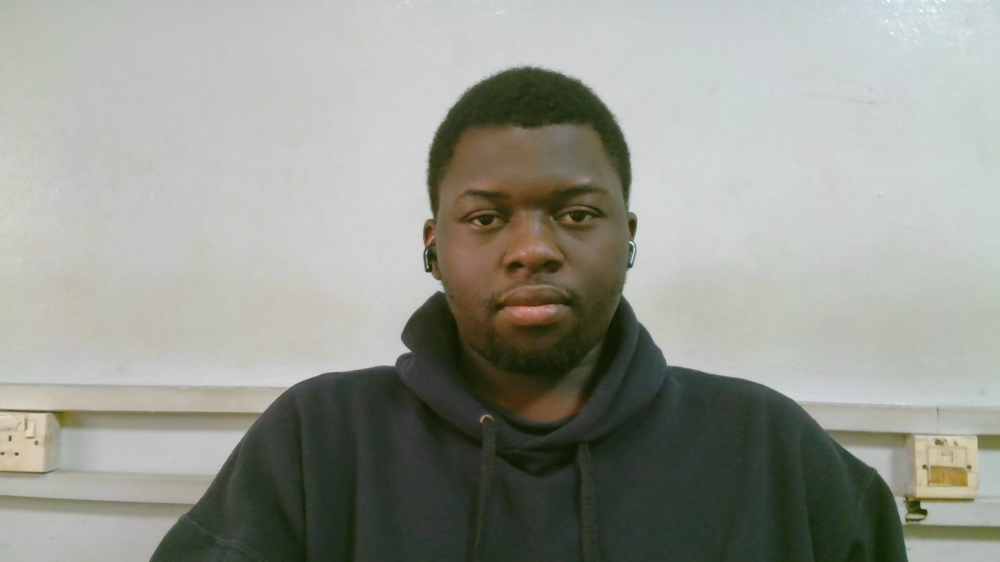

<!-- Banner Image Placeholder -->

  

<h1 align="center">Hi there, I'm Benjamin Ofili 👋</h1>
<h3 align="center">Full Stack Software Developer from Lagos, Nigeria 🇳🇬</h3>

  Passionate about crafting seamless cross-platform mobile experiences and building robust AI-integrated applications. I thrive at the intersection of mobile development and artificial intelligence, constantly exploring new ways to solve real-world problems.

  
  
  
  

---

### 🚀 What I'm Up To
* 🔭 **Currently working on:** Web and Mobile application development, focusing on scalable architecture.
* 🌱 **Currently learning:** Advanced AI integrations and Cloud infrastructure.
* 💡 **Passionate about:** Mobile engineering and Artificial Intelligence.
* 🎓 **Academic Journey:** Currently navigating my 4th semester of academic study. 
* ⚡ **Fun facts:** When I'm not coding, you can find me playing the piano or diving into open-world action games.

---

### 💻 Tech Stack & Tools

**Mobile & Frontend**

  
  
  
  

**Backend & AI**

  
  
  
  
  

---

### 🔥 Featured Projects

* **VERD:** [Insert a brief description of what VERD is, the main technologies used, and the problem it solves.]
* **TasteFlow:** A comprehensive full-stack online food ordering system featuring a Flask-based JSON API and role-based access for customers, owners, and admins.
* **AI Voice Translator:** A mobile application built with Flutter and Whisper.cpp that delivers offline, real-time voice translation.
* **MediConnect:** A telemedicine platform supporting seamless appointment scheduling and dedicated consultation video rooms.

---

### 📊 GitHub Stats

  

  

  <i>Let's connect and build something amazing together!</i>

